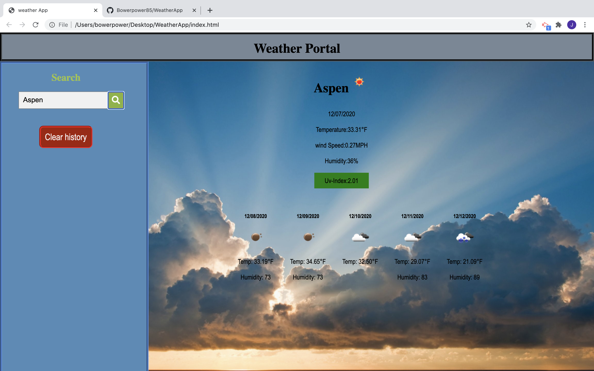

  # Project Title : Weather App
  ## Project Description:
  This is a simple application that allows the client to search for wether in a city of their choosing. The current weather and a 5 day forecast will be provided for a searched city. In addition searches are saved to local storage and rendered so the client can see previously searched cities for a quick reference. 
  ## Table of Contents
  * [Installation](#installation)
  * [Usage](#usage)
  * [Contributing](#contributing)
  * [Test](#test)
  * [Questions](#questions)
  * [License](#license)
  * [Author](#Author)
  ## Installation
  There is no installation. If you wish to use this as a reference or template just fork my repository. The application is also deployed on github pages https://git
hub.com/Bowerpower85/WeatherApp.
  ## Usage
  Navigate to the site and type a city into the searchbar the weather should render in the dashboard for viewing.
  ## Contributors
  Donald Chromy, Douglas Mitchell, Moses Kamara, Dan Seese
  ## Test
  N/A
  ## Questions
  If you have any questions, contact Bowerpower85 on GitHub or email at bowerpower85@gmail.com.
  ## License
  MIT License 
  Copyright (c) [year] [Bowerpower85]
  Permission is hereby granted, free of charge, to any person obtaining a copy
  of this software and associated documentation files (the "Software"), to deal
  in the Software without restriction, including without limitation the rights
  to use, copy, modify, merge, publish, distribute, sublicense, and/or sell
  copies of the Software, and to permit persons to whom the Software is
  furnished to do so, subject to the following conditions:
  The above copyright notice and this permission notice shall be included in all
  copies or substantial portions of the Software.
  THE SOFTWARE IS PROVIDED "AS IS", WITHOUT WARRANTY OF ANY KIND, EXPRESS OR
  IMPLIED, INCLUDING BUT NOT LIMITED TO THE WARRANTIES OF MERCHANTABILITY,
  FITNESS FOR A PARTICULAR PURPOSE AND NONINFRINGEMENT. IN NO EVENT SHALL THE
  AUTHORS OR COPYRIGHT HOLDERS BE LIABLE FOR ANY CLAIM, DAMAGES OR OTHER
  LIABILITY, WHETHER IN AN ACTION OF CONTRACT, TORT OR OTHERWISE, ARISING FROM,
  OUT OF OR IN CONNECTION WITH THE SOFTWARE OR THE USE OR OTHER DEALINGS IN THE
  SOFTWARE.
  ## Author
  

   